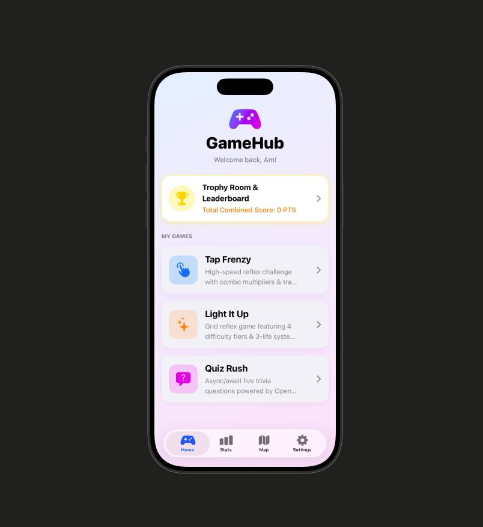
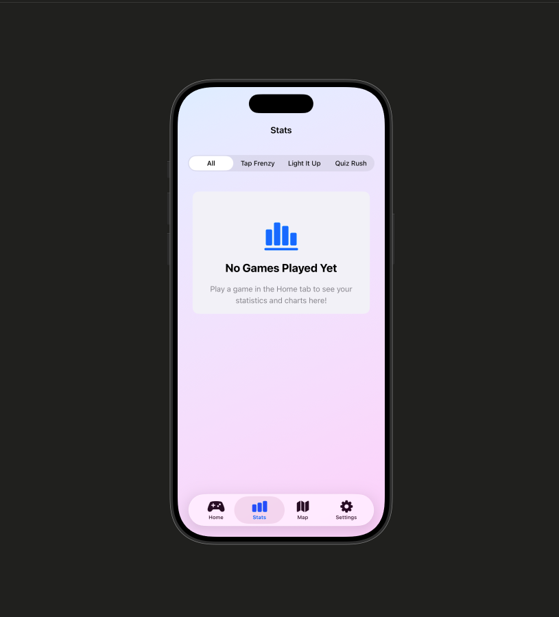
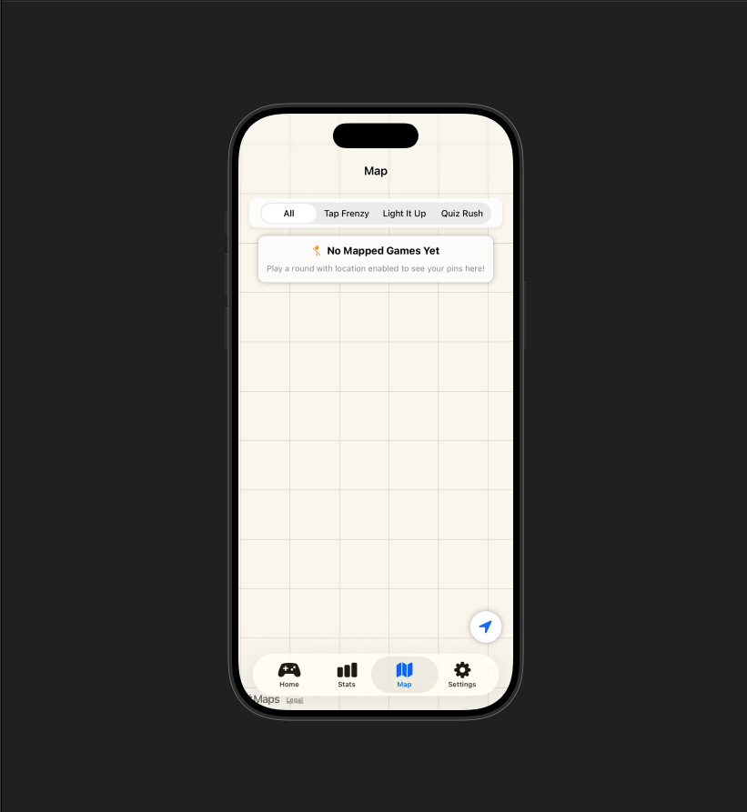
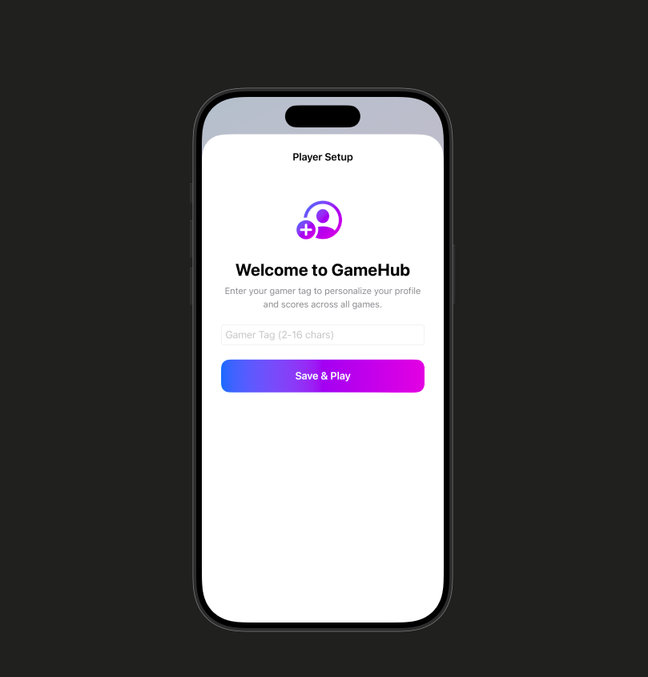
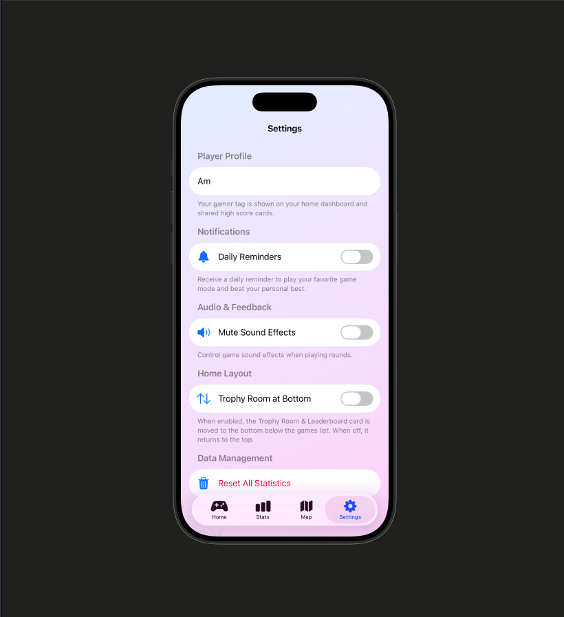
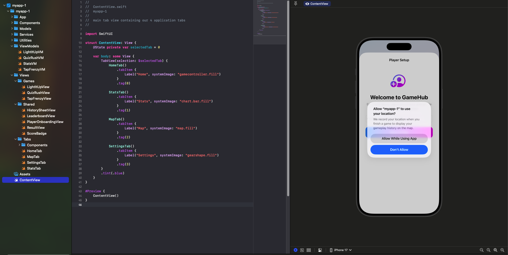

# PlayHub - iOS Coursework Project

PlayHub is a native iOS application built with SwiftUI as part of the iOS development coursework. The application integrates three interactive mini-games into a unified arcade platform featuring persistent gameplay tracking, interactive map visualization, dynamic statistical charts, local notifications, and native social sharing.

---

## Application Showcase

### Core Application Tabs

| Home Lobby & Arcade | Statistics & Analytics | Interactive Geolocation Map |
| :---: | :---: | :---: |
|  |  |  |

### Profile & Settings

| Player Setup & Onboarding | Preferences & Notifications |
| :---: | :---: |
|  |  |

### Development Environment

| Xcode & iOS Simulator Integration |
| :---: |
|  |

---

## Project Architecture & Tech Stack

* **UI Framework**: SwiftUI (`TabView`, `NavigationStack`, `SwiftUI Charts`)
* **Location Services**: CoreLocation & MapKit (`CLLocationManager`, `MapAnnotation`, `MKCoordinateRegion`)
* **Notifications Engine**: `UNUserNotificationCenter` (`UNCalendarNotificationTrigger`)
* **Audio & Haptics**: `AVFoundation` & `UIKit` (`AVAudioPlayer` in-memory PCM synthesis, `UIImpactFeedbackGenerator`)
* **Persistence Layer**: `UserDefaults` & `@AppStorage` (Codable JSON session records)

---

## Core Features & Modules

### 1. Interactive Mini-Games (`HomeTab` & `Views/Games/`)
* **Tap Frenzy**: A fast-paced reflex challenge where players tap a moving and shrinking target button. Features include:
  * Dynamic combo multipliers awarding up to 5x points for rapid consecutive taps.
  * Penalty trap states that penalize points if tapped while active.
  * Target size scaling based on total tap volume.
  * Periodic bonus bursts awarding extra points and timer extensions every 10 taps.
* **Light It Up**: A visual pattern memory game that illuminates sequences on a grid. Players test their short-term spatial memory by reproducing progressively longer card sequences under time pressure.
* **Quiz Rush**: A rapid-fire trivia game with instant color-coded feedback and score tracking.

### 2. Statistical Visualization (`StatsTab`)
* Powered by `SwiftUI Charts`, the statistics tab provides deep insights into player performance across all games.
* **Mode Filtering**: Users can filter analytics between All Games, Tap Frenzy, Light It Up, and Quiz Rush.
* **Data Views**:
  * Bar charts displaying score distributions and recent game performance.
  * Sector graphs (pie charts) breaking down games played by mode.
  * Summary metrics highlighting personal bests, average scores, and cumulative points achieved.

### 3. Geolocation & Interactive Map (`MapTab`)
* **Automatic Coordinate Capture**: When a player concludes a game session, `LocationService` retrieves current GPS coordinates using `CLLocationManager`.
* **Map Display**: Recorded sessions are plotted on an interactive `MapKit` view using custom colored markers corresponding to the game mode played.
* **Interactive Callouts**: Tapping a map pin displays a detailed card showing the score achieved, game mode, and exact timestamp.

### 4. Application Settings & Notifications (`SettingsTab`)
* **Daily Challenge Reminders**: Users can enable and schedule recurring local reminders (`UNCalendarNotificationTrigger`) to prompt daily gameplay sessions.
* **Audio Mute Control**: Provides a master toggle that instantly silences or restores synthesized sound effects across `SoundManager.shared`.
* **Data Management**: Includes a secure reset button with a destructive confirmation dialog allowing users to clear all recorded history and map locations.

### 5. Post-Game Results & Sharing (`Views/Shared/`)
* **Celebratory Result View**: Dynamically detects when a player achieves a new personal best (`ScoreBadge`) and updates visual styling accordingly.
* **Native ShareLink Integration**: Uses SwiftUI `ShareLink` to generate formatted achievement strings (`"I just scored 150 points in Tap Frenzy on PlayHub! Can you beat my score?"`) that can be shared via Messages, Mail, or social applications.

---

## Project Directory Structure

```text
myapp-1/
├── App/
│   └── PlayHubApp.swift             # Application entry point and service initialization
├── Components/
│   ├── AnimatedBackground.swift     # Reusable dynamic animated gradient background
│   ├── GameOverView.swift           # Reusable game over modal and overlay
│   ├── HighScoreView.swift          # High score display badge component
│   ├── LevelBadge.swift             # Level difficulty indicator badge
│   ├── NavigationCard.swift         # Reusable interactive card for home navigation
│   ├── PrimaryButton.swift          # Styled primary action button component
│   ├── ReadyPromptView.swift        # Pre-game countdown and ready prompt overlay
│   ├── ScoreView.swift              # Real-time score display component
│   └── TimerView.swift              # Real-time countdown timer component
├── ContentView.swift                # Main tab view container orchestrating the 4 core tabs
├── Models/
│   ├── GameMode.swift               # Game type enumeration, colors, and icons
│   ├── GameSession.swift            # Codable model representing completed games with coordinates
│   └── TriviaQuestion.swift         # Trivia question data structure and answer option models
├── Services/
│   ├── HistoryService.swift         # Singleton managing session persistence and filtering
│   ├── LocationService.swift        # CoreLocation wrapper tracking real-time coordinates
│   ├── NotificationService.swift    # UserNotifications wrapper managing daily challenge schedules
│   ├── SoundManager.swift           # Synthesized PCM WAV audio and haptic feedback controller
│   └── TriviaService.swift          # Service responsible for fetching and decoding live trivia questions
├── Utilities/
│   └── HTMLEntityDecoder.swift      # Utility helper for decoding HTML entities in trivia questions
├── ViewModels/
│   ├── LightItUpVM.swift            # State machine and sequence logic for Light It Up
│   ├── QuizRushVM.swift             # Question progression and timer logic for Quiz Rush
│   ├── StatsVM.swift                # Analytics data filtering, chart calculations, and summary metrics
│   └── TapFrenzyVM.swift            # Reflex arcade timing, combo, and trap calculations
└── Views/
    ├── Games/
    │   ├── LightItUpView.swift      # Grid interface for sequence memorization
    │   ├── QuizRushView.swift       # Multiple-choice trivia interface
    │   └── TapFrenzyView.swift      # Interactive reflex target play area
    ├── Shared/
    │   ├── HistorySheetView.swift   # Modal list displaying past session scores
    │   ├── LeaderboardView.swift    # High score rankings display
    │   ├── PlayerOnboardingView.swift # Onboarding screen for gamer tag and location setup
    │   ├── ResultView.swift         # Post-game summary card and native ShareLink
    │   └── ScoreBadge.swift         # Reusable score display and personal best indicator
    └── Tabs/
        ├── HomeTab.swift            # Game selection lobby and navigation cards
        ├── MapTab.swift             # MapKit view plotting geolocated game sessions
        ├── SettingsTab.swift        # User preferences, audio mute, and daily notification setup
        └── StatsTab.swift           # SwiftUI Charts analytics and metric breakdowns
```

---

## Build & Verification Instructions

### Requirements
* **macOS**: 13.0 or later
* **Xcode**: 15.0 or later (with iOS 16.0+ Simulator SDK)
* **Swift**: 5.9+

### Running via Command Line
To compile and build the application cleanly using `xcodebuild`:

```bash
cd myapp-1
xcodebuild -project myapp-1.xcodeproj -scheme myapp-1 -destination 'generic/platform=iOS Simulator' build
```

### Running via Xcode IDE
1. Open `myapp-1.xcodeproj` in Xcode.
2. Select an iPhone target (e.g., iPhone 15 or iPhone 16 Simulator) from the active scheme dropdown.
3. Press `Cmd + R` to build and run the project.
